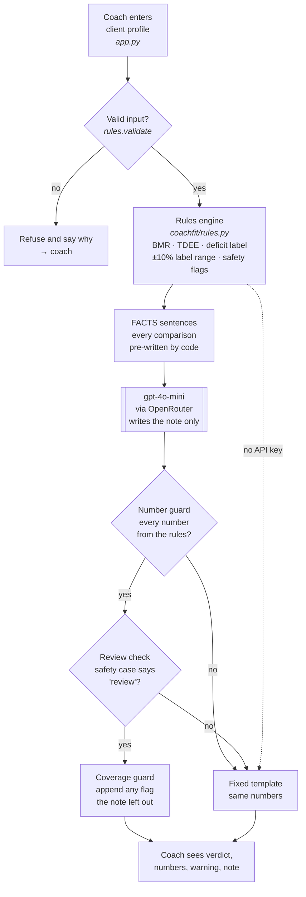

# CoachFit Cut Assistant — Product Documentation

Live app: https://coachfit-cut-assistant.streamlit.app · Code: https://github.com/Lizzy-808/coachfit-cut-assistant

## Persona

**Coach Huang**, a personal trainer at a commercial gym in Singapore with about 20 fat-loss
clients. Between sessions he checks each client's weekly average intake. He knows what
"maintenance calories" means but does not work out TDEE per client — by hand it takes him
5–10 minutes a client — and he has never seen a confidence range. He needs to know, quickly and
consistently, which clients are on track and which need his own attention.

**Not for:** clients under 18, medical conditions, eating disorders, pregnancy, meal planning.

## Input

One client profile, typed into a form:

| Field | Values | Rejected if |
|---|---|---|
| Age | years | outside 18–80 |
| Sex | male / female | other |
| Height | cm | outside 130–220 |
| Weight | kg | outside 35–250 |
| Activity level | sedentary · light · moderate · active · very active | other |
| Average daily intake | kcal | outside 500–7,000 |

No name or identifier is entered, and nothing identifying is sent to the model.

## Output

| Part | Produced by | Example (30-year-old man, 175 cm, 80 kg, moderate, 2,200 kcal) |
|---|---|---|
| Verdict and confidence | rules | **Appropriate** · confidence low |
| Label range under ±10% logging error | rules | too small → appropriate |
| Safety warning, when needed | rules | *(none here)* — e.g. "Coach review needed: intake below the 1,500 kcal floor" |
| Numbers behind it | rules | TDEE 2,711 · BMR 1,749 · deficit 511 · target intake 1,831–2,271 · BMI 26.12 |
| Coach note: summary, explanation, next step | model, checked by code | "The client's fat-loss plan is appropriate… Monitor the client's food logging closely." |
| Who wrote the note, tokens, cost | app | "AI (gpt-4o-mini), numbers verified · $0.00013" |

If the input is implausible the tool refuses and says why instead of answering.

## Architecture

| Box | Kind | File |
|---|---|---|
| Form and result page | own code on Streamlit | `app.py` |
| Validation, rules engine, FACTS | own deterministic logic | `coachfit/rules.py`, `coachfit/explain.py` |
| Note writer | rented model, `openai/gpt-4o-mini` | called in `coachfit/explain.py` |
| Number guard, review check, coverage guard, template | own deterministic logic | `coachfit/explain.py` |
| Evaluation judge (offline only) | rented model, `deepseek/deepseek-chat` | `eval/run_eval.py` |

The design rule: **the rules decide, the model only explains, and code checks the explanation.**
In testing, the model classified these cases correctly only 37–40% of the time when asked to
decide itself, so it is never in the decision path.

## Metrics — targeted vs reached

| Metric | Target | Reached | Source |
|---|---|---|---|
| **Flag fidelity** — note states every flag the rules raised, invents none (hand-graded, pre-registered, blind) | ≥ 24/25 | **25/25** (95% CI 86–100%) ✅ | `eval/confirmatory/results.json` |
| Omitted flags caught by the coverage detector | ≥ 95% | **16/16** ✅ | same |
| Errors added by the coverage guard | 0 | **0** ✅ | same |
| Rules vs independently computed reference labels | 100% | **787/787** ✅ | `eval/results/summary.json` |
| Safety cases routed to the coach | 100% | **27/27** ✅ | same |
| Implausible inputs refused, not guessed | 100% | **13/13** NHANES rows, 4/4 handwritten ✅ | same |
| Cost and latency per note | not set in advance | US$0.00014 · ~2 s | same |
| Coach reading time saved vs the template | ≥ 62 s per note (break-even, Class 5 method) | **not measured** — no coach trial yet ❌ | `eval/cost_to_serve.py` |

Context, not targets: unguarded model notes passed 10/25; a model classifying directly scored
37–40% (majority baseline 25%); 48% of real cases could change label under a 10% logging error.

## Known rough edges

- The four labels are finer than food-log accuracy supports; the ±10% range makes this visible.
- 18.5% of NHANES rows fall below the safety floor because one-day recalls under-report intake;
  with real weekly logs this share would likely be lower.
- All hand grading is by the author; no coach has graded notes or used the tool.
- Protein and other macronutrients are out of scope (no protein data to validate against).
